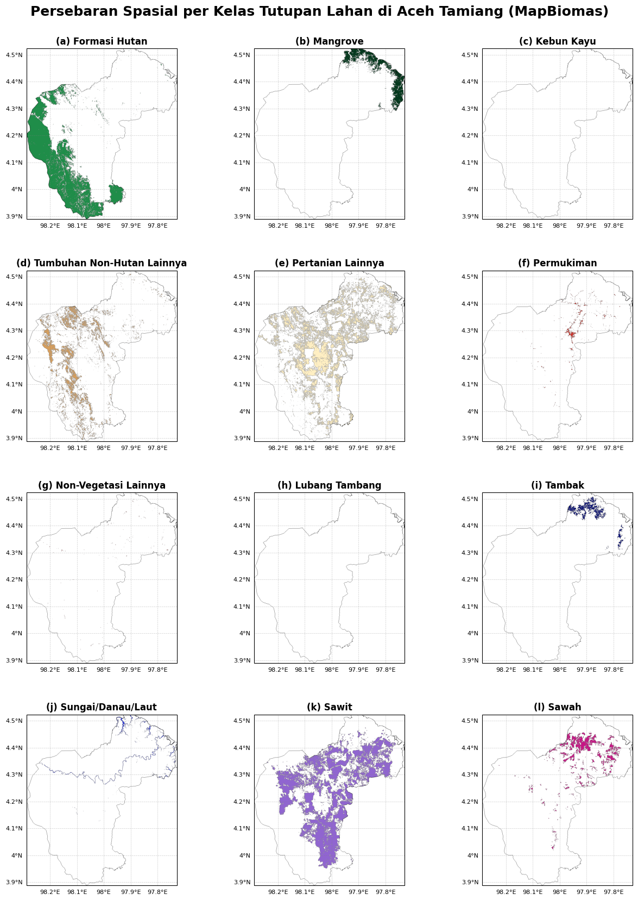
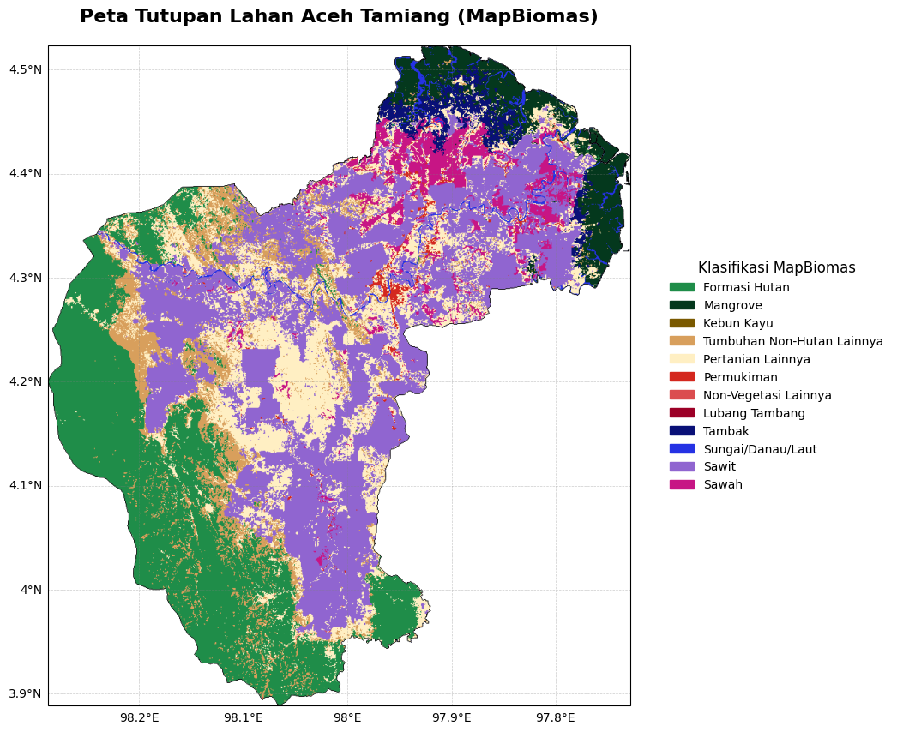

# Visualisasi Small Multiple Maps — Tutupan Lahan Aceh Tamiang (MapBiomas)

[](https://colab.research.google.com/drive/1E7EE865T0easynyJPQjU5ooUCVstAOXn?usp=sharing)
[](https://www.python.org/)
[](https://earthengine.google.com/)
[](https://mapbiomas.org/en)
[](https://opensource.org/licenses/MIT)

---

## Deskripsi

Notebook ini menyajikan teknik **visualisasi kartografis Small Multiple Maps** dan **Single Layout Map** berbasis data tutupan lahan dari **MapBiomas Indonesia (Collection 4)** untuk wilayah studi **Kabupaten Aceh Tamiang**. Setiap kelas tutupan lahan divisualisasikan secara mandiri dalam panel peta terpisah (*small multiples*), memungkinkan perbandingan spasial antar kelas secara simultan dan sistematis.

Pendekatan ini relevan dalam konteks pemantauan tutupan lahan berbasis *cloud computing* menggunakan Google Earth Engine (GEE), dengan rendering kartografis yang dihasilkan melalui `geemap.cartoee` dan `Cartopy`.

---

## Data & Area Kajian

| Parameter | Keterangan |
|---|---|
| **Sumber Data** | MapBiomas Indonesia — `collection4_coverage_v2` |
| **Tahun Klasifikasi** | 2022 (Small Multiple), 2024 (Single Layout) |
| **Area Studi** | Kabupaten Aceh Tamiang, Provinsi Aceh |
| **Batas Wilayah** | GEE Asset: `projects/ee-defaniarman/assets/ACEH_TAMIANG` |
| **Proyeksi** | Geographic — WGS84 / `PlateCarree` |
| **Resolusi Spasial** | 30 m (MapBiomas Indonesia Collection 4) |

---

## Kelas Tutupan Lahan

| ID | Kelas | Warna |
|:---:|---|:---:|
| 3 | Formasi Hutan | `#1f8d49` |
| 5 | Mangrove | `#04381d` |
| 9 | Kebun Kayu | `#7a5900` |
| 13 | Tumbuhan Non-Hutan Lainnya | `#d89f5c` |
| 21 | Pertanian Lainnya | `#ffefc3` |
| 24 | Permukiman | `#d4271e` |
| 25 | Non-Vegetasi Lainnya | `#db4d4f` |
| 30 | Lubang Tambang | `#9c0027` |
| 31 | Tambak | `#091077` |
| 33 | Sungai / Danau / Laut | `#2532e4` |
| 35 | Sawit | `#9065d0` |
| 40 | Sawah | `#c71585` |

---

## Hasil Visualisasi

### Small Multiple Maps — Persebaran Spasial per Kelas (2022)

Setiap panel merepresentasikan distribusi spasial satu kelas tutupan lahan secara terisolasi menggunakan teknik masking per-kelas pada citra klasifikasi MapBiomas.



---

### Single Layout Map — Tutupan Lahan Keseluruhan (2024)

Peta tunggal yang memuat seluruh kelas tutupan lahan secara bersamaan, dengan legenda eksternal dan teknik *remapping* nilai piksel untuk kompatibilitas parameter visualisasi GEE.



---

## Instalasi Dependensi

```bash
pip install geemap
pip install cartopy
pip install matplotlib
pip install earthengine-api
```

> **Prasyarat:** Autentikasi Google Earth Engine diperlukan sebelum menjalankan analisis. Pastikan akun GEE sudah terdaftar dan project ID telah dikonfigurasi.

---

## Alur Kerja

```
Autentikasi GEE
      │
      ▼
Load FeatureCollection (Batas Wilayah Aceh Tamiang)
      │
      ▼
Load & Clip Citra MapBiomas (per tahun klasifikasi)
      │
      ├──► Small Multiple Maps
      │         Masking per kelas → Panel terpisah (grid 4 × 3)
      │         Overlay batas wilayah + Gridlines per panel
      │         Label alfabet: (a), (b), (c), ...
      │
      └──► Single Layout Map
                Remap nilai kelas → urutan kontinu
                Satu peta + legenda eksternal
                Overlay batas wilayah + Gridlines
```

---

## Struktur Repository

```
.
├── smal_multiple_mb.ipynb   # Notebook utama
├── smal_multiple_mb.py      # Versi script Python
├── multiple.png             # Output small multiple maps
├── single.png               # Output single layout map
└── README.md
```

---

## Cara Penggunaan

1. Klik badge **Open In Colab** di bagian atas
2. Jalankan sel instalasi dependensi
3. Autentikasi GEE:
   ```python
   import ee
   ee.Authenticate()
   ee.Initialize(project='YOUR_PROJECT_ID')
   ```
4. Sesuaikan `project` ID dan path asset `FeatureCollection` dengan konfigurasi GEE Anda
5. Pilih sel yang ingin dijalankan: *Small Multiple Maps* atau *Single Layout*

---

## Library Utama

| Library | Fungsi | Referensi |
|---|---|---|
| `earthengine-api` | Akses dan komputasi data geospasial di GEE | [GitHub](https://github.com/google/earthengine-api) |
| `geemap` | Integrasi GEE dengan antarmuka Python interaktif | Wu (2020) |
| `geemap.cartoee` | Rendering layer GEE ke canvas Matplotlib/Cartopy | Markert (2019) |
| `cartopy` | Proyeksi kartografis dan gridlines geografis | Met Office (2013) |
| `matplotlib` | Visualisasi dan layout peta | Hunter (2007) |

---

## Referensi

- Hunter, J. D. (2007). Matplotlib: A 2D graphics environment. *Computing in Science & Engineering*, 9(3), 90–95.
- Markert, K. N. (2019). cartoee: Publication quality maps using Earth Engine. *Journal of Open Source Software*, 4(33), 1207. https://doi.org/10.21105/joss.01207
- Met Office. (2013). *Cartopy: A cartographic Python library with matplotlib support*. Exeter, Devon. http://scitools.org.uk/cartopy
- Wu, Q. (2020). geemap: A Python package for interactive mapping with Google Earth Engine. *Journal of Open Source Software*, 5(51), 2305. https://doi.org/10.21105/joss.02305

**Repository GitHub:**

| Library | Repository |
|---|---|
| Cartopy | https://github.com/scitools/cartopy |
| geemap | https://github.com/gee-community/geemap |
| cartoee | https://github.com/KMarkert/cartoee |
| Matplotlib | https://github.com/matplotlib/matplotlib |

**Data:**

> MapBiomas Indonesia — Collection 4.0. Time-series maps of land-use and land-cover. Accessed 23 May 2026 via GEE asset: `projects/mapbiomas-public/assets/indonesia/lulc/collection4/mapbiomas_indonesia_collection4_coverage_v2`

---

## Lisensi

Kode dalam repositori ini dirilis di bawah lisensi **MIT**. Data MapBiomas Indonesia tunduk pada [ketentuan penggunaan MapBiomas](https://mapbiomas.org/en/terms-of-use).

---

## Author

**Defani Arman Alfitriansyah**
[](https://github.com/Defani)
